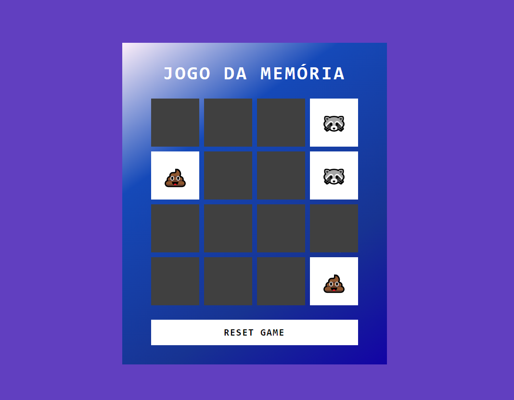

# Memory-Game

### Desafio feito pela DIO (Digital Innovation One)
Nesse desafio foi pensado em programar um jogo da memória usando apenas HTML, CSS e Javascript. Nesse conteúdo foi aprendido:
* Manipulação de DOM
* base do javascript

Jogo funcional com comparação de Emojis e botão de reiniciar o jogo

